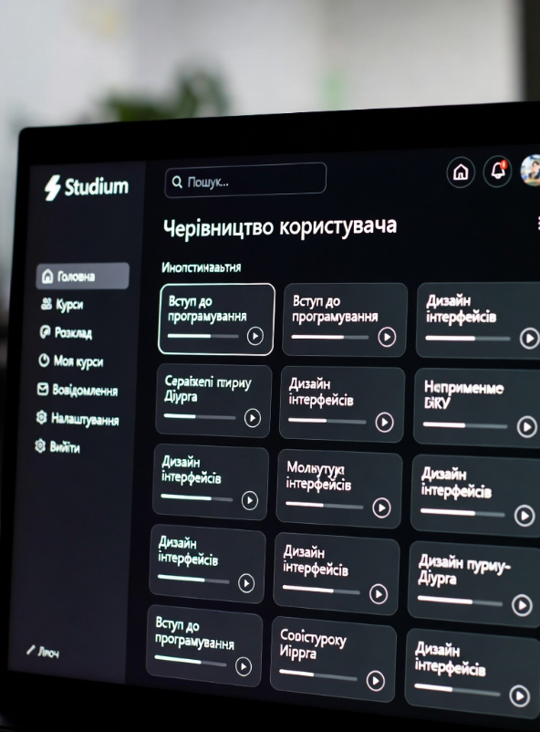

# Посібник користувача (для студентів)

Вітаємо у "Studium"! Цей посібник допоможе вам зробити перші кроки на платформі.

## Як почати роботу?

1.  **Створіть акаунт.** Перейдіть на головну сторінку та натисніть кнопку "Реєстрація".
2.  **Увійдіть у систему.** Використовуйте свій email та пароль для входу.
3.  **Знайдіть курс.** Перейдіть у "Каталог курсів", щоб побачити всі доступні предмети.
4.  **Запишіться на курс.** Натисніть кнопку "Записатися" на сторінці курсу.
5.  **Почніть навчання!** Ваш курс з'явиться у вашому "Особистому кабінеті".

## Приклад інтерфейсу

Після входу ви побачите ваш особистий кабінет (дашборд), де відображаються ваші поточні курси та прогрес.

## FAQ (Часті питання)

**П: Як мені здати домашнє завдання?**
**В:** На сторінці уроку знайдіть розділ "Домашнє завдання" та натисніть кнопку "Завантажити файл".

**П: Де я можу побачити свої оцінки?**
**В:** Усі оцінки знаходяться у вашому "Особистому кабінеті" у вкладці "Мій Прогрес".

**П: Я забув пароль, що робити?**
**В:** На сторінці входу натисніть "Забули пароль?" та дотримуйтесь інструкцій, які прийдуть вам на пошту.
